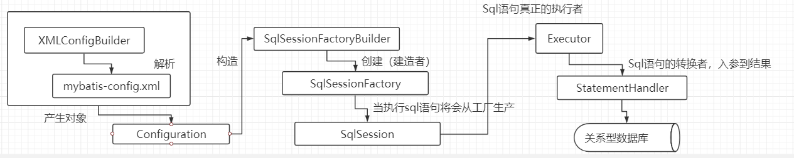
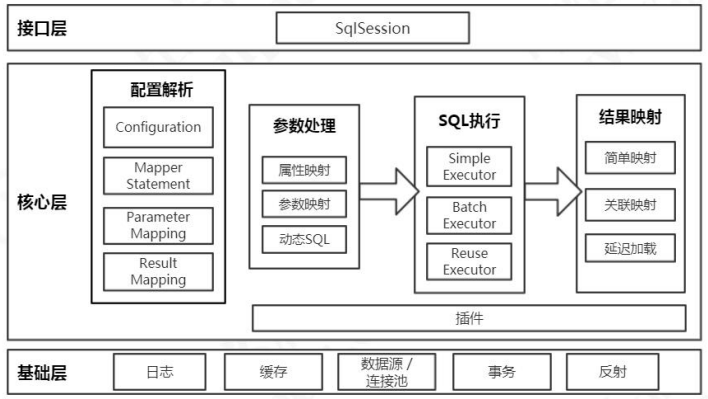
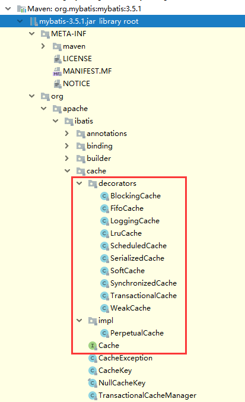
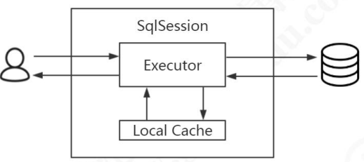
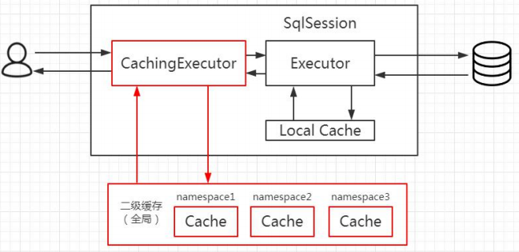
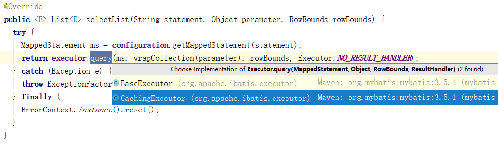
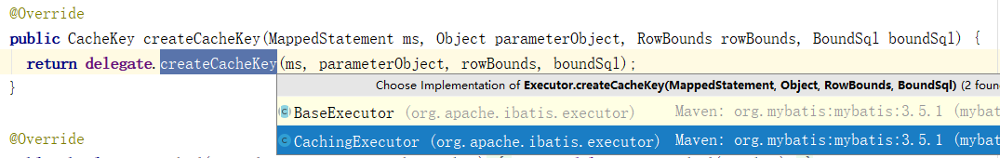
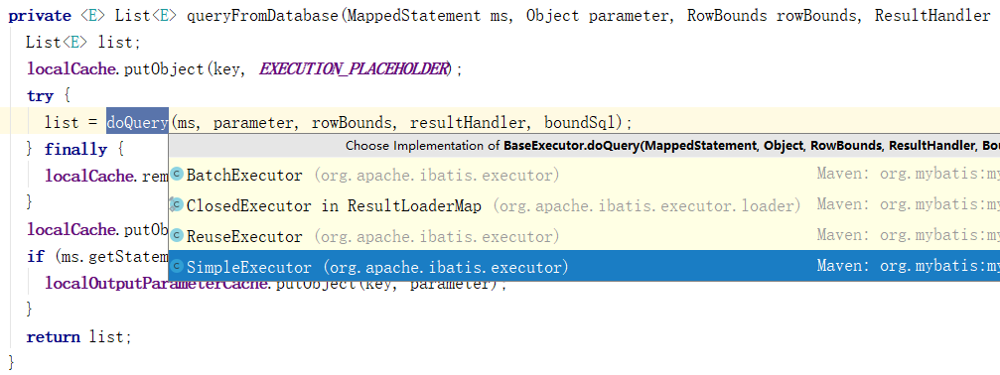
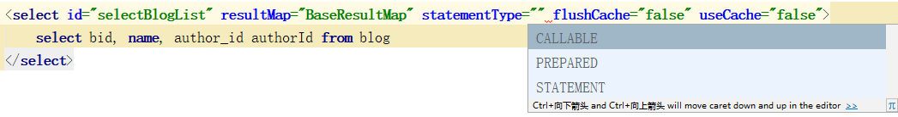
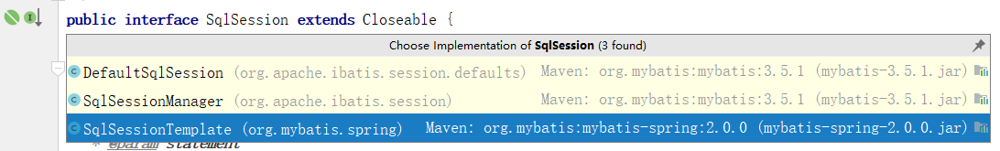

### Mybatis 学习笔记

### 写在前面

如果希望实现自己的ORM框架，需要注意以下几点
* 作为ORM框架，我们需要做到完善的对象关系的映射
* 为了简化对sql的操作，我们需要有自己地工具类，用来方便查询和修改，apache 的DBUtils和Spring 的 JDBCTemplate
* 资源地管理，一般提供 DataSource 的数据源对象
* 方便日后扩展，需要提供类似插件的抽象，用户可以实现自己地数据库映射，对象映射，语句不通阶段拦截
* 提高性能，拥有自己地缓存实现，并提供扩展第三方

#### Mybatis的使用

引入依赖，和mysql的依赖

```xml
 <dependency>
     <groupId>org.mybatis</groupId>
     <artifactId>mybatis</artifactId>
     <version>3.5.1</version>
 </dependency>

  <dependency>
      <groupId>mysql</groupId>
      <artifactId>mysql-connector-java</artifactId>
      <version>5.1.21</version>
  </dependency>
```

最简单的api使用（Mybatis前身-ibatis用法，并不存在mapper对象）

```java
public void testStatement() throws IOException {
    String resource = "mybatis-config.xml";//全局配置文件
    InputStream inputStream = Resources.getResourceAsStream(resource);
    SqlSessionFactory sqlSessionFactory = new 		    SqlSessionFactoryBuilder().build(inputStream);//解析配置文件，创建会话工厂
	//创建会话
    SqlSession session = sqlSessionFactory.openSession();
    try {
        //会话指定具体类下的方法和方法，与mybatis-config.xml中的mapper进行sql绑定
        //从而调用sql语句
        Blog blog = (Blog) session.selectOne("com.gupaoedu.mapper.BlogMapper.selectBlogById", 1);
        System.out.println(blog);
    } finally {
        session.close();
    }
}
```

现在比较常用，SqlSession.getMapper(XXXMapper.class) 接口方式

```java
 public void testSelect() throws IOException {
        String resource = "mybatis-config.xml";
        InputStream inputStream = Resources.getResourceAsStream(resource);
        SqlSessionFactory sqlSessionFactory = new SqlSessionFactoryBuilder().build(inputStream);

        SqlSession session = sqlSessionFactory.openSession(); // ExecutorType.BATCH
        try {
            //接口方式，直接调用接口
            BlogMapper mapper = session.getMapper(BlogMapper.class);
            Blog blog = mapper.selectBlogById(1);
            System.out.println(blog);
        } finally {
            session.close();
        }
    }
```

##### Mybatis的核心对象

* SqlSessionFactoryBuilder

  * 这个类可以被实例化、使用和丢弃，一旦创建了 SqlSessionFactory，就不再需要它了。 因此 SqlSessionFactoryBuilder 实例的最佳作用域是方法作用域（也就是局部方法变量）。 你可以重用 SqlSessionFactoryBuilder 来创建多个 SqlSessionFactory 实例，但是最好还是不要让其一直存在，以保证所有的 XML 解析资源可以被释放给更重要的事情。

* SqlSessionFactory

  * SqlSessionFactory 一旦被创建就应该在应用的运行期间一直存在，没有任何理由丢弃它或重新创建另一个实例。 使用 SqlSessionFactory 的最佳实践是在应用运行期间不要重复创建多次，多次重建 SqlSessionFactory 被视为一种代码“坏味道（bad smell）”。因此 SqlSessionFactory 的最佳作用域是应用作用域。 有很多方法可以做到，最简单的就是使用单例模式或者静态单例模式。

* SqlSession

  * 每个线程都应该有它自己的 SqlSession 实例。SqlSession 的实例**不是线程安全**的，因此是不能被共享的，所以它的最佳的作用域是请求或方法作用域。 绝对不能将 SqlSession 实例的引用放在一个类的静态域，甚至一个类的实例变量也不行。 也绝不能将 SqlSession 实例的引用放在任何类型的托管作用域中，比如 Servlet 框架中的 HttpSession。 如果你现在正在使用一种 Web 框架，要考虑 SqlSession 放在一个和 HTTP 请求对象相似的作用域中。 换句话说，每次收到的 HTTP 请求，就可以打开一个 SqlSession，返回一个响应，就关闭它。 这个关闭操作是很重要的，你应该把这个关闭操作放到 finally 块中以确保每次都能执行关闭。 下面的示例就是一个确保 SqlSession 关闭的标准模式：

    ```java
    try (SqlSession session = sqlSessionFactory.openSession()) {
      // 你的应用逻辑代码
    }
    ```

    

* Mapper

  * 映射器是一些由你创建的、绑定你映射的语句的接口。映射器接口的实例是从 SqlSession 中获得的。因此从技术层面讲，任何映射器实例的最大作用域是和请求它们的 SqlSession 相同的。尽管如此，映射器实例的最佳作用域是方法作用域。 也就是说，映射器实例应该在调用它们的方法中被请求，用过之后即可丢弃。 并不需要显式地关闭映射器实例，尽管在整个请求作用域保持映射器实例也不会有什么问题，但是你很快会发现，像 SqlSession 一样，在这个作用域上管理太多的资源的话会难于控制。 为了避免这种复杂性，最好把映射器放在方法作用域内。下面的示例就展示了这个实践：

    ```java
    try (SqlSession session = sqlSessionFactory.openSession()) {
      BlogMapper mapper = session.getMapper(BlogMapper.class);
      // 你的应用逻辑代码
    }
    ```


| 对象                                                      | 生命周期                     |
| --------------------------------------------------------- | ---------------------------- |
| SqlSessionFactoryBuilder(创建出SqlSessionFacotry就没用了) | 方法局部（method）           |
| SqlSessionFactroy(单例，只用来生成SqlSession)             | 应用级别（application）      |
| SqlSession                                                | 请求和操作（request/method） |
| Mapper                                                    | 方法（method）               |

##### Mybatis的配置对象

`XMLConfigBuilder`用于解析`mybatis-config.xml`文件

```xml
<configuration>
<!-- 最外面的配置-->
</configuration>
```

###### Properties

```xml
<properties resource="db.properties">
	<!--用于配置一些外部的属性-->
</properties>
```

###### Settings

```xml
<settings>
        <!-- 打印查询语句 -->
        <setting name="logImpl" value="STDOUT_LOGGING" />

        <!-- 控制全局缓存（二级缓存）-->
        <setting name="cacheEnabled" value="true"/>

        <!-- 延迟加载的全局开关。当开启时，所有关联对象都会延迟加载。默认 false  -->
        <setting name="lazyLoadingEnabled" value="true"/>
        <!-- 当开启时，任何方法的调用都会加载该对象的所有属性。默认 false，可通过select标签的 fetchType来覆盖-->
        <setting name="aggressiveLazyLoading" value="false"/>
        <!--  Mybatis 创建具有延迟加载能力的对象所用到的代理工具，默认JAVASSIST -->
        <!--<setting name="proxyFactory" value="CGLIB" />-->
        <!-- STATEMENT级别的缓存，使一级缓存，只针对当前执行的这一statement有效 -->
        <!--
                <setting name="localCacheScope" value="STATEMENT"/>
        -->
        <setting name="localCacheScope" value="SESSION"/>
</settings>
```

配置方言，当你的mapper文件的resultType就可以直接配置缩写

###### TypeAliases

```xml
<typeAliases>
        <typeAlias alias="blog" type="com.pop.domain.Blog" />
</typeAliases>
```

`TypeAliasRegistry`会统一注册在这里。

```java
public class TypeAliasRegistry {

  private final Map<String, Class<?>> typeAliases = new HashMap<>();

  public TypeAliasRegistry() {
    registerAlias("string", String.class);

    registerAlias("byte", Byte.class);
    registerAlias("long", Long.class);
    registerAlias("short", Short.class);
 //...
```

则意味着，你在写这样的标签的时候可以这样写。

```xml
<select id="selectBlog" parameterType="int" resultType="com.pop.domain.Blog">
        select blog_id blogId, blog_name blogName
        from blog where blog_id = #{blogId}
</select>
<!--改写-->
<select id="selectAuthor" parameterType="int" resultType="blog">
        select blog_id blogId, blog_name blogName
        from blog where blog_id = #{blogId}
</select>
<!--或者-->
<select id="xxx" parameterType="blog" >
      <!--....-->
</select>
```

###### TypeHandlers

具体类型java对象->jdbc自定义转换

```xml
<typeHandlers>
    <typeHandler handler="com.pop.type.MyTypeHandler"></typeHandler>
</typeHandlers>
```
Mybatis里默认的类型处理。

```java
public final class TypeHandlerRegistry {

//....

  private Class<? extends TypeHandler> defaultEnumTypeHandler = EnumTypeHandler.class;

  public TypeHandlerRegistry() {
    register(Boolean.class, new BooleanTypeHandler());
    register(boolean.class, new BooleanTypeHandler());
    register(JdbcType.BOOLEAN, new BooleanTypeHandler());
    register(JdbcType.BIT, new BooleanTypeHandler());

    register(Byte.class, new ByteTypeHandler());
    register(byte.class, new ByteTypeHandler());
    register(JdbcType.TINYINT, new ByteTypeHandler());
//...
```

自己定义的jdbc到java类型的规则，java到jdbc的规则。

```java
public class MyTypeHandler extends BaseTypeHandler<String> {
    public void setNonNullParameter(PreparedStatement ps, int i, String parameter, JdbcType jdbcType)
            throws SQLException {
        // 设置 String 类型的参数的时候调用，Java类型到JDBC类型
        // 注意只有在字段上添加typeHandler属性才会生效
        // insertBlog name字段
        // java->jdbc的转换
        System.out.println("---------------setNonNullParameter1："+parameter);
        ps.setString(i, parameter);
    }

    public String getNullableResult(ResultSet rs, String columnName) throws SQLException {
        // 根据列名获取 String 类型的参数的时候调用，JDBC类型到java类型
        // 注意只有在字段上添加typeHandler属性才会生效
        // jdbc->java的转换 传入行名
        System.out.println("---------------getNullableResult1："+columnName);
        return rs.getString(columnName);
    }

    public String getNullableResult(ResultSet rs, int columnIndex) throws SQLException {
        // 根据下标获取 String 类型的参数的时候调用
        System.out.println("---------------getNullableResult2："+columnIndex);
        // jdbc->java的转换 行位置索引
        return rs.getString(columnIndex);
    }

    public String getNullableResult(CallableStatement cs, int columnIndex) throws SQLException {
        System.out.println("---------------getNullableResult3：");
        // jdbc->java的转换 行位置索引，存储过程
        return cs.getString(columnIndex);
    }
}
```

你也可以指定扫描一个包下的类型转换规则。

```xml
<typeHandlers>
  <typeHandler handler="org.mybatis.example.ExampleTypeHandler"/>
</typeHandlers>
```

当你的类似配置完成后，用到的话就是插入的时候和查询的时候，因为都设计类型转换的问题。

```xml
<resultMap id="BaseResultMap" type="blog">
        <id column="bid" property="bid" jdbcType="INTEGER"/>
<!--
       <result column="name" property="name" jdbcType="VARCHAR"/>
-->
    	 <result column="name" property="name" jdbcType="VARCHAR" typeHandler="com.gupaoedu.type.MyTypeHandler"/>
        <result column="author_id" property="authorId" jdbcType="INTEGER"/>
    </resultMap>
```

###### ObjectFactory

MyBatis 每次创建结果对象的新实例时，它都会使用一个对象工厂（ObjectFactory）实例来完成。 默认的对象工厂需要做的仅仅是实例化目标类，要么通过默认构造方法，要么在参数映射存在的时候通过参数构造方法来实例化。 如果想覆盖对象工厂的默认行为，则可以通过创建自己的对象工厂来实现。比如

```java
public class ExampleObjectFactory extends DefaultObjectFactory {
   //适用于无参构造器
  @Override
  public Object create(Class type) {
     System.out.println("创建对象方法：" + type);
        if (type.equals(Blog.class)) {
            //在这里面加一些自己的配置
            //例如你想对某个商品的卖出数目好看点，可以进行价格乘以多少
            //又或者身份证号或者手机号中间几位用*号显示，这样可以隐藏
            Blog blog = (Blog) super.create(type);
            blog.setName("object factory");
            blog.setBid(1111);
            blog.setAuthorId(2222);
            return blog;
        }
        Object result = super.create(type);
     return result;
  }
  // 适合有参的构造器
  @Override
  public Object create(Class type, List<Class> constructorArgTypes, List<Object> constructorArgs) {
    return super.create(type, constructorArgTypes, constructorArgs);
  }
  public void setProperties(Properties properties) {
    super.setProperties(properties);
  }
  public <T> boolean isCollection(Class<T> type) {
    return Collection.class.isAssignableFrom(type);
  }}
//你可以选择适合自己的去重写方法
```

在xml文件中配置

```xml
<objectFactory type="com.pop.objectfactory.IObjectFactory">
      <property name="pop" value="666"/>
</objectFactory>
```

#### 动态SQL

```xml
<!--
UPDATE categories SET
    display_order = CASE id
        WHEN 1 THEN 3
        WHEN 2 THEN 4
        WHEN 3 THEN 5
    END,
    title = CASE id
        WHEN 1 THEN 'New Title 1'
        WHEN 2 THEN 'New Title 2'
        WHEN 3 THEN 'New Title 3'
    END
WHERE id IN (1,2,3)
-->
<!-- List 批量更新 -->
	<update id="upldateList">
		update blog set 
		name = 
		<!-- open 的参数为  开头，separator 分割 close 结束 批量更新中，有多少符合条件地，就会有多少 when 与 then-->
		<foreach collection="list" item="blogs" index="index" separator=" " open="case bid" close="end">
			when #{blogs.bid} then #{blogs.name}
		</foreach>
		,author_id = 
		<foreach collection="list" item="blogs" index="index" separator=" " open="case bid" close="end">
			when #{blogs.bid} then #{blogs.authorId}
		</foreach>
		where bid in 
		<foreach collection="list" item="item" open="(" separator="," close=")">
			#{item.bid,JdbcType=INTEGER}
		</foreach>
	</update>

<!-- List 批量删除  -->
    <delete id="deleteByList" parameterType="java.util.List">
        delete from tbl_emp where emp_id in
        <foreach collection="list" item="item" open="(" separator="," close=")">
            #{item.empId,jdbcType=VARCHAR}
        </foreach>
    </delete>
<!-- 批量插入 -->
    <insert id="batchInsert" parameterType="java.util.List" useGeneratedKeys="true">
        <selectKey resultType="long" keyProperty="id" order="AFTER">
            SELECT LAST_INSERT_ID()
        </selectKey>
        insert into tbl_emp (emp_id, emp_name, gender,email, d_id)
        values
        <!--对应的方法参数上的集合名字就叫list，如果是其他名字也可以写-->
        <foreach collection="list" item="emps" index="index" separator=",">
            ( #{emps.empId},#{emps.empName},#{emps.gender},#{emps.email},#{emps.dId} )
        </foreach>
    </insert>
<!--有选择的插入-->
    <insert id="insertSelective" parameterType="com.pop.crud.bean.Employee">
        insert into tbl_emp
        <trim prefix="(" suffix=")" suffixOverrides=",">
            <if test="empId != null">
                emp_id,
            </if>
            <if test="empName != null">
                emp_name,
            </if>
            <if test="gender != null">
                gender,
            </if>
            <if test="email != null">
                email,
            </if>
            <if test="dId != null">
                d_id,
            </if>
        </trim>
        <trim prefix="values (" suffix=")" suffixOverrides=",">
            <if test="empId != null">
                #{empId,jdbcType=INTEGER},
            </if>
            <if test="empName != null">
                #{empName,jdbcType=VARCHAR},
            </if>
            <if test="gender != null">
                #{gender,jdbcType=CHAR},
            </if>
            <if test="email != null">
                #{email,jdbcType=VARCHAR},
            </if>
            <if test="dId != null">
                #{dId,jdbcType=INTEGER},
            </if>
        </trim>
    </insert>

```

关于批处理的语句，带一句Mybatis中由SqlSessionFactory创建出来的SqlSession中正在执行方法的是Excutor（执行器），在官网Excutor拥有三种类型`simple,reuse,batch`

* SimpleExcutor 是Mybatis的默认配置，他支持statment，也就是语句创建，用完就会销毁
* ReuseExcutor 使用的preparestatement，支持预编译，会将编译后的语句存储起来，方便下次使用
* BatchExcutor 可以执行批处理操作，其实就是使用了preparestatement进行了addbatch操作最后excutebatch，可以将语句缓存起来最后一期发送给数据库，提高批量删除和批量插入的效率。


#### 嵌套查询

例如一个博客有一名作者，这就是简单的一对一的关系 `one to one`，其中一个关系会变成属性放在对象里面。像是这样。

```java
public class BlogAndAuthor implements Serializable {
    Integer bid; // 文章ID
    String name; // 文章标题
    Author author; // 作者
    //...
```

当你使用这个对象去sql操作的时候mybatis是如何将他转换的。

##### 嵌套查询

在mapper文件里，你需要这样配置，这个author的属性要写成这样。

```xml
<!-- 第一种的嵌套查询-->
<!-- 根据文章查询作者，一对一查询的结果，嵌套查询 -->
<resultMap id="BlogWithAuthorResultMap" type="com.gupaoedu.domain.associate.BlogAndAuthor">
        <id column="bid" property="bid" jdbcType="INTEGER"/>
        <result column="name" property="name" jdbcType="VARCHAR"/>
        <!-- 联合查询，将author的属性映射到ResultMap -->
        <association property="author" javaType="com.gupaoedu.domain.Author">
            <id column="author_id" property="authorId"/>
            <result column="author_name" property="authorName"/>
        </association>
    </resultMap>

<!-- 根据文章查询作者，一对一，嵌套结果，无N+1问题 可以根据设置的map变成相应对象-->
    <select id="selectBlogWithAuthorResult" resultMap="BlogWithAuthorResultMap" >
        select b.bid, b.name, b.author_id, a.author_id , a.author_name
        from blog b
        left join author a
        on b.author_id=a.author_id
        where b.bid = #{bid, jdbcType=INTEGER}
    </select>

<!-- 第二种嵌套查询-->
<!-- 另一种联合查询(一对一)的实现，但是这种方式有“N+1”的问题 -->
    <resultMap id="BlogWithAuthorQueryMap" type="com.gupaoedu.domain.associate.BlogAndAuthor">
        <id column="bid" property="bid" jdbcType="INTEGER"/>
        <result column="name" property="name" jdbcType="VARCHAR"/>
        <!--这里不再定义完整的结构，而是变成了对 select 属性配置 
		-->
        <association property="author" javaType="com.gupaoedu.domain.Author"
                     column="author_id" select="selectAuthor"/> <!-- selectAuthor 定义在下面-->
    </resultMap>

<!-- 嵌套查询 -->
    <select id="selectAuthor" parameterType="int" resultType="com.gupaoedu.domain.Author">
        select author_id authorId, author_name authorName
        from author where author_id = #{authorId}
    </select>

<!-- 根据文章查询作者，一对一，嵌套查询，存在N+1问题，可通过开启延迟加载解决 -->
    <select id="selectBlogWithAuthorQuery" resultMap="BlogWithAuthorQueryMap" >
        select b.bid, b.name, b.author_id, a.author_id , a.author_name
        from blog b
        left join author a
        on b.author_id=a.author_id
        where b.bid = #{bid, jdbcType=INTEGER}
    </select>
```

**N+1问题**

以author和blog作为例子，在第二种嵌套查询中，每当你执行`selectBlogWithAuthorQuery`这个查询时候，作为结果返回的`BlogWithAuthorQueryMap`中也同样会进行`association`中`selectAuthor`的再次查询。也就是意味着，如果你的一条查询语句查询出了多条结果，由于每条结果都有`association`这样的属性，即便你没有使用这个属性也会进一步触发你下一次查询，也就是`selectAuthor`里面定义的这条语句。1指的是一条查询语句，N指的是可能由于查询多条结果再次触发多条查询。

如果我没有用到author属性，所以我不想让他触发查询的话，可以使用延迟加载机制，在属性文件中配置，这个属性默认是false的

```xml
<settings>
        <!-- 延迟加载的全局开关。当开启时，所有关联对象都会延迟加载。默认 false  -->
        <setting name="lazyLoadingEnabled" value="true"/>
</settings>
```

配置这个属性后，当你调用某个特殊的方法时才会触发查询。例如`getAuthor()`

如果你配置了

```xml
<settings>
        <!-- 延迟加载的全局开关。当开启时，所有关联对象都会延迟加载。默认 false  -->
        <setting name="lazyLoadingEnabled" value="true"/>
         <!-- 当开启时，任何方法的调用都会加载该对象的所有属性。默认 false，可通过select标签的 fetchType来覆盖-->
        <setting name="aggressiveLazyLoading" value="true"/>
</settings>
```

无论你调用什么方法，都会触发一下次查询，toString，HashCode都会触发查询。你也可以自定义方法来触发

```xml

<settings>
        <!-- 延迟加载的全局开关。当开启时，所有关联对象都会延迟加载。默认 false  -->
        <setting name="lazyLoadingEnabled" value="true"/>
         <!-- 当开启时，任何方法的调用都会加载该对象的所有属性。默认 false，可通过select标签的 fetchType来覆盖-->
        <setting name="aggressiveLazyLoading" value="true"/>
        <!--指定哪个对象的方法触发一次延迟加载-->
        <setting name="lazyLoadTriggerMethods" value="equals,clone,hashCode,toString"/>
</settings>
```

https://mybatis.org/mybatis-3/zh/configuration.html

##### 嵌套结果

这其实是个很常见的操作，例如一个作者会有多篇博客，就是一对多的关系 `one to many`，然而

##### 一对多

entity

```java
public class BlogAndComment {
    Integer bid; // 文章ID
    String name; // 文章标题
    Integer authorId; // 文章作者ID
    List<Comment> comment; // 文章评论
```

mapper配置

```xml
<resultMap id="BaseResultMap" type="blog">
        <id column="bid" property="bid" jdbcType="INTEGER"/>
        <result column="name" property="name" jdbcType="VARCHAR"/>
        <result column="author_id" property="authorId" jdbcType="INTEGER"/>
</resultMap>

 <!--  查询文章带评论的结果（一对多） -->
    <resultMap id="BlogWithCommentMap" type="com.pop.domain.associate.BlogAndComment" extends="BaseResultMap" >
        <collection property="comment" ofType="com.pop.domain.Comment">
            <id column="comment_id" property="commentId" />
            <result column="content" property="content" />
        </collection>
    </resultMap>

!-- 根据文章查询评论，一对多 -->
    <select id="selectBlogWithCommentById" resultMap="BlogWithCommentMap" >
        select b.bid, b.name, b.author_id authorId, c.comment_id commentId, c.content
        from blog b, comment c
        where b.bid = c.bid
        and b.bid = #{bid}
    </select>
```

##### 多对多（尽量避免）

entity

```java
public class AuthorAndBlog {
    Integer author_id; // 作者ID
    String author_name; // 作者名称
    List<BlogAndComment> blog; // 文章和评论列表
```

mapper

```xml
<!--  按作者查询文章评论的结果（多对多） -->
    <resultMap id="AuthorWithBlogMap" type="com.pop.domain.associate.AuthorAndBlog" >
        <id column="author_id" property="authorId" jdbcType="INTEGER"/>
        <result column="author_name" property="authorName" jdbcType="VARCHAR"/>
        <collection property="blog" ofType="com.pop.domain.associate.BlogAndComment">
            <id column="bid" property="bid" />
            <result column="name" property="name" />
            <result column="author_id" property="authorId" />
                <collection property="comment" ofType="com.pop.domain.Comment">
                    <id column="comment_id" property="commentId" />
                    <result column="content" property="content" />
                </collection>
    	</collection>
    </resultMap>

<!-- 根据作者文章评论，多对多 -->
    <select id="selectAuthorWithBlog" resultMap="AuthorWithBlogMap" >
        select b.bid, b.name, a.author_id authorId, a.author_name authorName, c.comment_id commentId, c.content
        from blog b, author a, comment c
        where b.author_id = a.author_id and b.bid = c.bid
    </select>
```

#### Mapper文件的继承

如果你有一个Mapper.xml文件，你想要重用里面的内容，你可以选择拷贝一份，再加点什么东西，可以这里面的东西就太多了，能不能像java一样继承父类就自动拥有了父类的方法，只需要在子类里加自定义的参数就可以了呢。

```java
public interface BlogMapper {
    /**
     * 根据主键查询文章
     * @param bid
     * @return
     */
    public Blog selectBlogById(Integer bid);

    /**
     * 根据实体类查询文章
     * @param blog
     * @return
     */
    public List<Blog> selectBlogByBean(Blog blog );
//...
```

mapper文件

```xml
<mapper namespace="com.gupaoedu.mapper.BlogMapper">
    <!-- ...-->
```

然后你再定义一个

```java
public interface BlogMapperExt extends BlogMapper {
    /**
     * 根据名称查询文章
     * @param name
     * @return
     */
    public Blog selectBlogByName(String name);
}
```

mapper

```xml
<mapper namespace="com.gupaoedu.mapper.BlogMapperExt">
    <!-- 只能继承statement，不能继承sql、resultMap等标签 -->
    <resultMap id="BaseResultMap" type="blog">
        <id column="bid" property="bid" jdbcType="INTEGER"/>
        <result column="name" property="name" jdbcType="VARCHAR"/>
        <result column="author_id" property="authorId" jdbcType="INTEGER"/>
    </resultMap>

    <!-- 在parent xml 和child xml 的 statement id相同的情况下，会使用child xml 的statement id -->
    <select id="selectBlogByName" resultMap="BaseResultMap" statementType="PREPARED">
        select * from blog where name = #{name}
    </select>
</mapper>
```

#### Mybatis的流程



`解析配置文件->创建工厂类->创建会话->会话操作数据库`

##### 架构图



##### 缓存




MyBatis 跟缓存相关的类都在 cache 包里面，其中有一个 Cache 接口，只有一个默 认的实现类 `PerpetualCache`，它是用 HashMap 实现的。 除此之外，还有很多的装饰器，通过这些装饰器可以额外实现很多的功能：回收策 略、日志记录、定时刷新等等。 

| 缓存实现类          | 描述             | 作用                                                         | 装饰条件                                          |
| ------------------- | ---------------- | ------------------------------------------------------------ | ------------------------------------------------- |
| 基本缓存            | 缓存基本实现类   | 默认是 PerpetualCache，也可以自定义比如 RedisCache、EhCache 等，具备基本功能的缓存类 | 无                                                |
| LruCache            | LRU 策略的缓存   | 当缓存到达上限时候，删除最近最少使用的缓存 （Least Recently Use） | eviction="LRU"（默认）                            |
| FifoCache           | FIFO 策略的缓存  | 当缓存到达上限时候，删除最先入队的缓存                       | eviction="FIFO"                                   |
| SoftCache WeakCache | 带清理策略的缓存 | 通过 JVM 的软引用和弱引用来实现缓存，当 JVM 内存不足时，会自动清理掉这些缓存，基于SoftReference 和 WeakReference | eviction="SOFT" eviction="WEAK"                   |
| LoggingCache        | 带日志功能的缓存 | 比如：输出缓存命中率                                         | 基本                                              |
| SynchronizedCache   | 同步缓存         | 基于 synchronized 关键字实现，解决并发问题                   | 基本                                              |
| SerializedCache     | 支持序列化的缓存 | 将对象序列化以后存到缓存中，取出时反序列化                   | readOnly=false（默 认）                           |
| ScheduledCache      | 定时调度的缓存   | 在进行 get/put/remove/getSize 等操作前，判断 缓存时间是否超过了设置的最长缓存时间（默认是一小时），如果是则清空缓存--即每隔一段时间清 | flushInterval 不为 空                             |
| TransactionalCache  | 事务缓存         | 在二级缓存中使用，可一次存入多个缓存，移除多 个缓存          | 在TransactionalCacheManager 中用 Map 维护对应关系 |

###### 一级缓存

他是会话级别，SqlSession级别的。他存在Executor中。

```java
public class DefaultSqlSession implements SqlSession {

  private final Configuration configuration;// 缓存不太可能存在配置里面
  private final Executor executor;// 只有他了
    //...
    
public abstract class BaseExecutor implements Executor {

  private static final Log log = LogFactory.getLog(BaseExecutor.class);

  protected Transaction transaction;
  protected Executor wrapper;

  protected ConcurrentLinkedQueue<DeferredLoad> deferredLoads;
  protected PerpetualCache localCache; // 在这里 PerpetualCache 是Cache的唯一实现
  protected PerpetualCache localOutputParameterCache;
  protected Configuration configuration;
    // ....
```



​	尝试去一级缓存中取得，如果没有就去数据库去查。

要测试一级缓存，首先要将二级缓存关闭。

```xml
<settings>
	<!-- 控制全局缓存（二级缓存）默认是开启的-->
    <setting name="cacheEnabled" value="false"/>
</settings>
```

mapper中也不能有相关二级缓存的配置。同一个Session中会共享，不同的Session是无法共享的。当你执行了一次删除修改更新操作时，一级缓存就会被更新。如果你不想执行某个操作的时候不清空缓存的话，可以在mapper文件中配置。

```xml
<!-- select 标签默认是关闭的，也就是false-->
<select id="selectBlogList" resultMap="BaseResultMap" flushCache="false">
        select bid, name, author_id authorId from blog
    </select>
<!-- update 标签默认是开启的，也就是true-->
<update id="updateByPrimaryKey" parameterType="blog" flushCache="true">
        update blog
        set name = #{name,jdbcType=VARCHAR}
        where bid = #{bid,jdbcType=INTEGER}
    </update>
<!--你也指定哪个语句不要更新缓存，设置成false就可以了-->
```

###### 二级缓存

二级缓存的作用域更广，是`namespace`级别，也就是一个mapper.xml文件里的所有sql语句都可以共享同一个会话，同时，二级缓存开启后，他是优先与一级缓存的。



同时，如果你的事务不提交的话，是无法写入二级缓存的，所以二级缓存还是支持事务的。

```java
public class CachingExecutor implements Executor {

  private final Executor delegate;
    //这里
  private final TransactionalCacheManager tcm = new TransactionalCacheManager();
    //...

public class TransactionalCacheManager {
	// 这里
  private final Map<Cache, TransactionalCache> transactionalCaches = new HashMap<>();

  public void clear(Cache cache) {
    getTransactionalCache(cache).clear();
  }

  public Object getObject(Cache cache, CacheKey key) {
    return getTransactionalCache(cache).getObject(key);
  }

  public void putObject(Cache cache, CacheKey key, Object value) {
    getTransactionalCache(cache).putObject(key, value);
  }

  public void commit() {
    for (TransactionalCache txCache : transactionalCaches.values()) {
      txCache.commit();//当事务提交了以后，缓存才会被提交
    }
  }
    //....
    
public class TransactionalCache implements Cache {

  private static final Log log = LogFactory.getLog(TransactionalCache.class);

  private final Cache delegate;
  private boolean clearOnCommit;
  private final Map<Object, Object> entriesToAddOnCommit;
  private final Set<Object> entriesMissedInCache;
//...
```

**如何开启二级缓存**

`mybatis-config.xml`里面

```xml
<settings>
	<!-- 控制全局缓存（二级缓存）默认是开启的-->
    <setting name="cacheEnabled" value="true"/>
</settings>
```

同时，还有在mapper里面指定。

```xml
<mapper namespace="com.gupaoedu.mapper.BlogMapper">
    <!-- 声明这个namespace使用二级缓存 他的其他配置都可以是默认的-->
    <cache/>
    <!-- 使用Redis作为二级缓存 -->
<!--
    <cache type="org.mybatis.caches.redis.RedisCache"
           eviction="FIFO" flushInterval="60000" size="512" readOnly="true"/>
-->
    <!--        <cache type="org.apache.ibatis.cache.impl.PerpetualCache"
               size="1024"
               eviction="LRU"
               flushInterval="120000"
               readOnly="false"/>-->
    <!--....-->
```

如果你的映射方法里，有个方法不希望使用二级缓存，可以配置。

```xml
<select id="selectBlogList" resultMap="BaseResultMap" useCache="false">
        select bid, name, author_id authorId from blog
    </select>
```

二级的缓存的缺点也是很明显的，就是由于可以跨Session共享，当某个Session执行了一个更新操作的时候就会清空其它Session的缓存。

所以我们尽量在查询为主的语句中使用二级缓存。


#### MyBatis源码分析

最原始的mybatis编程

```java
public void testSelect() throws IOException {
        String resource = "mybatis-config.xml";
        InputStream inputStream = Resources.getResourceAsStream(resource);
    // 从这里进入
        SqlSessionFactory sqlSessionFactory = new SqlSessionFactoryBuilder().build(inputStream);

        SqlSession session = sqlSessionFactory.openSession(); // ExecutorType.BATCH
        try {
            BlogMapper mapper = session.getMapper(BlogMapper.class);
            Blog blog = mapper.selectBlogById(1);
            System.out.println(blog);
        } finally {
            session.close();
        }
    }
```

进入到SqlSessionFacotry的内容

```java
public SqlSessionFactory build(InputStream inputStream, String environment, Properties properties) {
    try {
      XMLConfigBuilder parser = new XMLConfigBuilder(inputStream, environment, properties);
      return build(parser.parse());//这里
```

进入XmlConfigBuilder中

```java
public Configuration parse() {
    if (parsed) {//判断是否已经解析过
      throw new BuilderException("Each XMLConfigBuilder can only be used once.");
    }
    parsed = true;//从 configuration 最外面的标签开始 mybatis-config.xml
    parseConfiguration(parser.evalNode("/configuration"));
    return configuration;
  }
```

`parseConfiguration`方法

```java
private void parseConfiguration(XNode root) {
    try {
      //issue #117 read properties first
        // 很熟悉的 解析一级标签
      propertiesElement(root.evalNode("properties"));
      Properties settings = settingsAsProperties(root.evalNode("settings"));
      loadCustomVfs(settings);//加载远程 配置
      loadCustomLogImpl(settings);// 加载日志实现
      typeAliasesElement(root.evalNode("typeAliases"));
      pluginElement(root.evalNode("plugins"));
      objectFactoryElement(root.evalNode("objectFactory"));
      objectWrapperFactoryElement(root.evalNode("objectWrapperFactory"));
      reflectorFactoryElement(root.evalNode("reflectorFactory"));
      settingsElement(settings);
      // read it after objectFactory and objectWrapperFactory issue #631
      environmentsElement(root.evalNode("environments"));
      databaseIdProviderElement(root.evalNode("databaseIdProvider"));
      typeHandlerElement(root.evalNode("typeHandlers"));
      mapperElement(root.evalNode("mappers"));
    } catch (Exception e) {
      throw new BuilderException("Error parsing SQL Mapper Configuration. Cause: " + e, e);
    }
  }
```

##### Mybatis中二级缓存原理

当你开启二级缓存的时候，其实是开启了`CachingExcutor`会装饰你默认Excutor，可能是simple也可以是reuse又或者是batch

```java
@Override
  public SqlSession openSession() {
    return openSessionFromDataSource(configuration.getDefaultExecutorType(), null, false);
  }
  
  private SqlSession openSessionFromDataSource(ExecutorType execType, TransactionIsolationLevel level, boolean autoCommit) {
    Transaction tx = null;
    try {
      final Environment environment = configuration.getEnvironment();
      final TransactionFactory transactionFactory = getTransactionFactoryFromEnvironment(environment);
      tx = transactionFactory.newTransaction(environment.getDataSource(), level, autoCommit);
        //这里
      final Executor executor = configuration.newExecutor(tx, execType);
      return new DefaultSqlSession(configuration, executor, autoCommit);
  
//Configuration.java        
 public Executor newExecutor(Transaction transaction, ExecutorType executorType) {
    executorType = executorType == null ? defaultExecutorType : executorType;
    executorType = executorType == null ? ExecutorType.SIMPLE : executorType;
    Executor executor;
    if (ExecutorType.BATCH == executorType) {
      executor = new BatchExecutor(this, transaction);
    } else if (ExecutorType.REUSE == executorType) {
      executor = new ReuseExecutor(this, transaction);
    } else {
      executor = new SimpleExecutor(this, transaction);
    }
    if (cacheEnabled) {//开启了二级缓存，将会被装饰
      executor = new CachingExecutor(executor);
    }
    executor = (Executor) interceptorChain.pluginAll(executor);
    return executor;
  }
```

同时，当我们执行一个查询方法的时候，



```java
// CachingExecutor.java
@Override
  public <E> List<E> query(MappedStatement ms, Object parameterObject, RowBounds rowBounds, ResultHandler resultHandler) throws SQLException {
    BoundSql boundSql = ms.getBoundSql(parameterObject);
      //二级缓存的生成原理
    CacheKey key = createCacheKey(ms, parameterObject, rowBounds, boundSql);
    return query(ms, parameterObject, rowBounds, resultHandler, key, boundSql);
  }
```



点击进入BaseExecutor

```java
public CacheKey createCacheKey(MappedStatement ms, Object parameterObject, RowBounds rowBounds, BoundSql boundSql) {
    if (closed) {
      throw new ExecutorException("Executor was closed.");
    }
    CacheKey cacheKey = new CacheKey();
    cacheKey.update(ms.getId());//创建这个key有几个维度，一个是id，代表了映射方法的全路径名加上方法
    cacheKey.update(rowBounds.getOffset());//上下两个都是分页的信息
    cacheKey.update(rowBounds.getLimit());
    cacheKey.update(boundSql.getSql());// sqk语句
    //....
    for (ParameterMapping parameterMapping : parameterMappings) {
      if (parameterMapping.getMode() != ParameterMode.OUT) {
        Object value;
        String propertyName = parameterMapping.getProperty();
        if (boundSql.hasAdditionalParameter(propertyName)) {
          value = boundSql.getAdditionalParameter(propertyName);
        } else if (parameterObject == null) {
          value = null;
        } else if (typeHandlerRegistry.hasTypeHandler(parameterObject.getClass())) {
          value = parameterObject;
        } else {
          MetaObject metaObject = configuration.newMetaObject(parameterObject);
          value = metaObject.getValue(propertyName);
        }
        cacheKey.update(value);// 入参的不同也会导致缓存不同
      }
    }
```

回到查询的逻辑

```java
@Override
  public <E> List<E> query(MappedStatement ms, Object parameterObject, RowBounds rowBounds, ResultHandler resultHandler, CacheKey key, BoundSql boundSql)
      throws SQLException {
    Cache cache = ms.getCache();// 当我们在保证配置文件中的二级缓存是存在的时候，同时在mapper文件中配置了cache标签的时，这里就可以获取到值
    if (cache != null) {
      flushCacheIfRequired(ms);//即便存在，这里会判断select标签上是否需要清空二级缓存 flushCache
      if (ms.isUseCache() && resultHandler == null) {
        ensureNoOutParams(ms, boundSql);
        @SuppressWarnings("unchecked")
          // 支持事务安全的缓存，可以支持批量删除和添加的缓存
          // private final TransactionalCacheManager tcm = new TransactionalCacheManager();
        List<E> list = (List<E>) tcm.getObject(cache, key);
        if (list == null) {
          list = delegate.query(ms, parameterObject, rowBounds, resultHandler, key, boundSql);
          tcm.putObject(cache, key, list); // issue #578 and #116
        }
        return list;
      }
    }
      // 上面这些都是二级缓存的流程，如果二级缓存不存在，就会直接去数据库查询
    return delegate.query(ms, parameterObject, rowBounds, resultHandler, key, boundSql);
  }
```

从数据库查询

```java
public <E> List<E> query(MappedStatement ms, Object parameter, RowBounds rowBounds, ResultHandler resultHandler, CacheKey key, BoundSql boundSql) throws SQLException {
    ErrorContext.instance().resource(ms.getResource()).activity("executing a query").object(ms.getId());
    if (closed) {
      throw new ExecutorException("Executor was closed.");
    }
    if (queryStack == 0 && ms.isFlushCacheRequired()) {
      clearLocalCache();
    }
    List<E> list;
    try {
      queryStack++;
      list = resultHandler == null ? (List<E>) localCache.getObject(key) : null;
      if (list != null) {
        handleLocallyCachedOutputParameters(ms, key, parameter, boundSql);
      } else {
          // 这里
        list = queryFromDatabase(ms, parameter, rowBounds, resultHandler, key, boundSql);
      }
    } 
    //...
```



```java
 @Override
  public <E> List<E> doQuery(MappedStatement ms, Object parameter, RowBounds rowBounds, ResultHandler resultHandler, BoundSql boundSql) throws SQLException {
    Statement stmt = null;
    try {
        // 拿到配置对象
      Configuration configuration = ms.getConfiguration();
        //决定要拿到哪种类似的StatementHandler
      StatementHandler handler = configuration.newStatementHandler(wrapper, ms, parameter, rowBounds, resultHandler, boundSql);
      stmt = prepareStatement(handler, ms.getStatementLog());
      return handler.query(stmt, resultHandler);
    } finally {
      closeStatement(stmt);
    }
  }

public StatementHandler newStatementHandler(Executor executor, MappedStatement mappedStatement, Object parameterObject, RowBounds rowBounds, ResultHandler resultHandler, BoundSql boundSql) {
    //这里做了路由
    StatementHandler statementHandler = new RoutingStatementHandler(executor, mappedStatement, parameterObject, rowBounds, resultHandler, boundSql);
    //用插件进行了层层代理
    statementHandler = (StatementHandler) interceptorChain.pluginAll(statementHandler);
    return statementHandler;
  }

// RoutingStatementHandler.java
public RoutingStatementHandler(Executor executor, MappedStatement ms, Object parameter, RowBounds rowBounds, ResultHandler resultHandler, BoundSql boundSql) {

    switch (ms.getStatementType()) {
      case STATEMENT:
        delegate = new SimpleStatementHandler(executor, ms, parameter, rowBounds, resultHandler, boundSql);
        break;
      case PREPARED:
        delegate = new PreparedStatementHandler(executor, ms, parameter, rowBounds, resultHandler, boundSql);
        break;
      case CALLABLE:
        delegate = new CallableStatementHandler(executor, ms, parameter, rowBounds, resultHandler, boundSql);
        break;
      default:
        throw new ExecutorException("Unknown statement type: " + ms.getStatementType());
    }

  }
```



这个决定了你要使用哪种statement，默认是prepared。第三种是存储过程的，不用管。

```java

public PreparedStatementHandler(Executor executor, MappedStatement mappedStatement, Object parameter, RowBounds rowBounds, ResultHandler resultHandler, BoundSql boundSql) {
    super(executor, mappedStatement, parameter, rowBounds, resultHandler, boundSql);
  }

//BaseStatementHandler.java
protected BaseStatementHandler(Executor executor, MappedStatement mappedStatement, Object parameterObject, RowBounds rowBounds, ResultHandler resultHandler, BoundSql boundSql) {
    this.configuration = mappedStatement.getConfiguration();
    this.executor = executor;
    this.mappedStatement = mappedStatement;
    this.rowBounds = rowBounds;

    this.typeHandlerRegistry = configuration.getTypeHandlerRegistry();
    this.objectFactory = configuration.getObjectFactory();

    if (boundSql == null) { // issue #435, get the key before calculating the statement
      generateKeys(parameterObject);
      boundSql = mappedStatement.getBoundSql(parameterObject);
    }

    this.boundSql = boundSql;
	//这两个地方会创建另外两个核心对象，ParamterHandler与ResultSetHanlder
    // 处理入参
    this.parameterHandler = configuration.newParameterHandler(mappedStatement, parameterObject, boundSql);
    //处理结果集
    this.resultSetHandler = configuration.newResultSetHandler(executor, mappedStatement, rowBounds, parameterHandler, resultHandler, boundSql);
  }

// Configuration.java
public ParameterHandler newParameterHandler(MappedStatement mappedStatement, Object parameterObject, BoundSql boundSql) {
    ParameterHandler parameterHandler = mappedStatement.getLang().createParameterHandler(mappedStatement, parameterObject, boundSql);
    // 插件代理的第三个地方
    parameterHandler = (ParameterHandler) interceptorChain.pluginAll(parameterHandler);
    return parameterHandler;
  }

// Configuration.java
public ResultSetHandler newResultSetHandler(Executor executor, MappedStatement mappedStatement, RowBounds rowBounds, ParameterHandler parameterHandler,
      ResultHandler resultHandler, BoundSql boundSql) {
    ResultSetHandler resultSetHandler = new DefaultResultSetHandler(executor, mappedStatement, parameterHandler, resultHandler, boundSql, rowBounds);
    // 插件代理的第四个地方
    resultSetHandler = (ResultSetHandler) interceptorChain.pluginAll(resultSetHandler);
    return resultSetHandler;
  }
```

所以其实官网上插件可以拦截四大对象，分别是 Executor，StatementHanlder，ParameterHandler,ResultSetHandler这四类，也是在这些过程中拦截的，由于是代理，所以会由外到内的拦截。

##### Mybatis的插件

在`XmlConfigurationBuilder`对象中

```java
private void parseConfiguration(XNode root) {
    try {
      //issue #117 read properties first
      propertiesElement(root.evalNode("properties"));
      Properties settings = settingsAsProperties(root.evalNode("settings"));
      loadCustomVfs(settings);
      loadCustomLogImpl(settings);
      typeAliasesElement(root.evalNode("typeAliases"));
        // 插件部分
      pluginElement(root.evalNode("plugins"));
      objectFactoryElement(root.evalNode("objectFactory"));
      objectWrapperFactoryElement(root.evalNode("objectWrapperFactory"));
      reflectorFactoryElement(root.evalNode("reflectorFactory"));
      settingsElement(settings);
      //....
        
private void pluginElement(XNode parent) throws Exception {
    if (parent != null) {
      for (XNode child : parent.getChildren()) {
        String interceptor = child.getStringAttribute("interceptor");
        Properties properties = child.getChildrenAsProperties();
        Interceptor interceptorInstance = (Interceptor) resolveClass(interceptor).newInstance();
        interceptorInstance.setProperties(properties);
          //最后所有被配置好的插件都会被放在Configuration里面
        configuration.addInterceptor(interceptorInstance);
      }
    }
  }
        
// Configuration.java
 protected final InterceptorChain interceptorChain = new InterceptorChain();       
 public void addInterceptor(Interceptor interceptor) {
    interceptorChain.addInterceptor(interceptor);
  }
  
// InterceotirChain.java
public class InterceptorChain {

  private final List<Interceptor> interceptors = new ArrayList<>();

  public Object pluginAll(Object target) {
    for (Interceptor interceptor : interceptors) {
      target = interceptor.plugin(target);
    }
    return target;
  }

  public void addInterceptor(Interceptor interceptor) {
    interceptors.add(interceptor);
  }

  public List<Interceptor> getInterceptors() {
    return Collections.unmodifiableList(interceptors);
  }

}        
```

其实最后解析的对象都会被保存在一个list里面。list里面都是实现了Interceptor接口的插件类。

```java
public interface Interceptor {

  Object intercept(Invocation invocation) throws Throwable;

  Object plugin(Object target);

  void setProperties(Properties properties);

}
```

当newExecutor的时候，又或者newStatementHanlder之类的时候，会调用

```java
executor = (Executor) interceptorChain.pluginAll(executor);
```

这样的方法，根据上面的interceptorChain的方法，可以知道。

```java
public Object pluginAll(Object target) {
    for (Interceptor interceptor : interceptors) {
      target = interceptor.plugin(target);//都会统一调用这个方法。
    }
    return target;
  }
```

按照官网的规定，每一个实现了插件的类，他的样子应该符合。

```java
@Intercepts({@Signature(type = Executor.class,method = "query",
        args = {MappedStatement.class, Object.class, RowBounds.class, ResultHandler.class})
})
public class MyPageInterceptor implements Interceptor {
    @Override
    public Object intercept(Invocation invocation) throws Throwable {
        // 执行被拦截方法
        return invocation.proceed();
    }

    @Override
    public Object plugin(Object target) {
        // 也就是说每个执行了pluginAll的方法会调用每个插件的这个方法。这个是实现的规范
        return Plugin.wrap(target, this);
    }

    @Override
    public void setProperties(Properties properties) {
    }
}

// Plugin.java
// 这个方法返回的是其实代理 那四个对象 Executor，StatementHandler，ResultSetHanlder,ParamterHanlder,会赛进 Object target 参数中，连同插件对象interceptor赛进这个Plugin中，生成代理对象
public static Object wrap(Object target, Interceptor interceptor) {
    // 解析参数
    Map<Class<?>, Set<Method>> signatureMap = getSignatureMap(interceptor);
    Class<?> type = target.getClass();
    // 找到所有的接口，用于代理
    Class<?>[] interfaces = getAllInterfaces(type, signatureMap);
    if (interfaces.length > 0) {
      return Proxy.newProxyInstance(
          type.getClassLoader(),
          interfaces,
          new Plugin(target, interceptor, signatureMap));
    }
    return target;
  }

private static Class<?>[] getAllInterfaces(Class<?> type, Map<Class<?>, Set<Method>> signatureMap) {
    Set<Class<?>> interfaces = new HashSet<>();
    while (type != null) {
      for (Class<?> c : type.getInterfaces()) {
        if (signatureMap.containsKey(c)) {
          interfaces.add(c);
        }
      }
      type = type.getSuperclass();//再找父类，保证都找到
    }
    return interfaces.toArray(new Class<?>[interfaces.size()]);
  }

// 然后从参数中读取需要拦截的对象，利用反射将他们缓存起来
@Intercepts({@Signature(type = Executor.class,method = "query",
        args = {MappedStatement.class, Object.class, RowBounds.class, ResultHandler.class})
})
//类似上面的参数，如果没找到就会报错
private static Map<Class<?>, Set<Method>> getSignatureMap(Interceptor interceptor) {
    Intercepts interceptsAnnotation = interceptor.getClass().getAnnotation(Intercepts.class);
    // issue #251
    if (interceptsAnnotation == null) {//没找到就会报错
      throw new PluginException("No @Intercepts annotation was found in interceptor " + interceptor.getClass().getName());
    }
    Signature[] sigs = interceptsAnnotation.value();
    Map<Class<?>, Set<Method>> signatureMap = new HashMap<>();
    for (Signature sig : sigs) {
        //将他们缓存起来
      Set<Method> methods = signatureMap.computeIfAbsent(sig.type(), k -> new HashSet<>());
      try {
          //method = "query" 方法名和参数列表，拿到对象，否则拿不到就会报错。
        Method method = sig.type().getMethod(sig.method(), sig.args());
          //填充到缓存里面
        methods.add(method);
      } catch (NoSuchMethodException e) {
        throw new PluginException("Could not find method on " + sig.type() + " named " + sig.method() + ". Cause: " + e, e);
      }
    }
    return signatureMap;
  }
//到此，所有需要被拦截的对象都会被缓存到signatureMap中。
// 当调用链条形成的时候
public Object invoke(Object proxy, Method method, Object[] args) throws Throwable {
    try {
        //取出对象
      Set<Method> methods = signatureMap.get(method.getDeclaringClass());
        //是否包含，是的话，进行拦截
      if (methods != null && methods.contains(method)) {
        return interceptor.intercept(new Invocation(target, method, args));
      }
        //否则，走原来的方法
      return method.invoke(target, args);
    } catch (Exception e) {
      throw ExceptionUtil.unwrapThrowable(e);
    }
  }
```


##### Mybatis是如何整合到Spring中

其中，mybatis-spring作为连接spring和mybatis的桥梁是很重要的，他实现了spring中的特殊规定的扩展点，来达到整合的目的。

```xml
 <!-- 在Spring启动时创建 sqlSessionFactory -->
    <bean id="sqlSessionFactory" class="org.mybatis.spring.SqlSessionFactoryBean">
        <property name="configLocation" value="classpath:mybatis-config.xml"></property>
        <property name="mapperLocations" value="classpath:mapper/*.xml"></property>
        <property name="dataSource" ref="dataSource"/>
    </bean>
```

按照规定，这主要是为了生成SqlSessionFactory对象的

```java
public class SqlSessionFactoryBean implements FactoryBean<SqlSessionFactory>, InitializingBean, ApplicationListener<ApplicationEvent> {
    private static final Logger LOGGER = LoggerFactory.getLogger(SqlSessionFactoryBean.class);
    private Resource configLocation;
    private Configuration configuration;
    private Resource[] mapperLocations;
    private DataSource dataSource;
    //....
    
// 作为InitializingBean将会调用这个方法
public void afterPropertiesSet() throws Exception {
        Assert.notNull(this.dataSource, "Property 'dataSource' is required");
        Assert.notNull(this.sqlSessionFactoryBuilder, "Property 'sqlSessionFactoryBuilder' is required");
        Assert.state(this.configuration == null && this.configLocation == null || this.configuration == null || this.configLocation == null, "Property 'configuration' and 'configLocation' can not specified with together");
    //这个方法 返回DefaultSqlSessionFacotry 1️⃣
        this.sqlSessionFactory = this.buildSqlSessionFactory();
    }
    //....
    
protected SqlSessionFactory buildSqlSessionFactory() throws IOException {
    //这个对象很熟悉，他就是解析配置文件的方法，所有当这个对象完成实例化后，就会走这个方法，如果有全局配置文件 mybatis-config.xml就会开始解析。
        XMLConfigBuilder xmlConfigBuilder = null;
        Configuration targetConfiguration;
        if (this.configuration != null) {
            targetConfiguration = this.configuration;
            if (targetConfiguration.getVariables() == null) {
                targetConfiguration.setVariables(this.configurationProperties);
            } else if (this.configurationProperties != null) {
                targetConfiguration.getVariables().putAll(this.configurationProperties);
            }
 //....    2️⃣ 熟悉的builder创建对象
	return this.sqlSessionFactoryBuilder.build(targetConfiguration);
//SqlSessionFactoryBuilder.java 2️⃣
public SqlSessionFactory build(Configuration config) {
    return new DefaultSqlSessionFactory(config);
  }
            
// 由于实现了FactoryBean方法也就会实现 getObject方法来产生对象交给ioc容器管理
 public SqlSessionFactory getObject() throws Exception {
        if (this.sqlSessionFactory == null) {
            this.afterPropertiesSet();
        }
		//然后被这里返回 1️⃣
        return this.sqlSessionFactory;
    }           
```

SqlSessionFactory已经知道如何创建了，接着就是找到如何创建SqlSession了。

但是这里是存在一个问题的。原先的默认实现DefaultSqlSession是编程案例的创建爱你出来的，但是如果要整合到Spring中有一个问题。

```java
/**
 * The default implementation for {@link SqlSession}.
 	这里已经说得很明确了，这个类不是线程安全的
 * Note that this class is not Thread-Safe.
 *
 * @author Clinton Begin
 */
public class DefaultSqlSession implements SqlSession {
```

```xml
<!--配置一个可以执行批量的sqlSession，全局唯一，单例 -->
    <bean id="sqlSession" class="org.mybatis.spring.SqlSessionTemplate">
        <constructor-arg  ref="sqlSessionFactory"></constructor-arg>
        <constructor-arg  value="BATCH"></constructor-arg>
    </bean>
```

由于如果整到到spring的时候，mapper是会被注入到controller里面的，controller是个单例多线程的对象，意味着如果有多个请求，产生了数据库操作会话SqlSession会有线程安全问题，而Mapper对象作为SqlSession从中诞生的，同样会有这个问题，那有没有什么替代方案呢？



很显然，`SqlSessionTemplate`作为`DefaultSqlSession`的替代品，他的第一行注释就说明了。

```java
/** 
	//这里第一句话就说明了，他是由Spring管理的，线程安全的
 * Thread safe, Spring managed, {@code SqlSession} that works with Spring
 * transaction management to ensure that that the actual SqlSession used is the
 * 
 * 	....
 * @see SqlSessionFactory
 * @see MyBatisExceptionTranslator
 */
public class SqlSessionTemplate implements SqlSession, DisposableBean {
```

为什么说他是线程安全的，我们可以对比一下`SqlSessionTemplate`和`DefaultSqlSession`的区别

```java
// DefaultSqlSession.java
@Override
  public void select(String statement, ResultHandler handler) {
    select(statement, null, RowBounds.DEFAULT, handler);
  }

  @Override
  public void select(String statement, Object parameter, RowBounds rowBounds, ResultHandler handler) {
    try {
      MappedStatement ms = configuration.getMappedStatement(statement);
      executor.query(ms, wrapCollection(parameter), rowBounds, handler);
    } catch (Exception e) {
      throw ExceptionFactory.wrapException("Error querying database.  Cause: " + e, e);
    } finally {
      ErrorContext.instance().reset();
    }
  }

// SqlSessionTemplate.java
@Override
  public void select(String statement, Object parameter, ResultHandler handler) {
    this.sqlSessionProxy.select(statement, parameter, handler);
  }
```

`SqlSessionTemplate` 并没有直接调用`Executor`来执行查询，而是使用`sqlSessionProxy`来进行替代。

```java
public class SqlSessionTemplate implements SqlSession, DisposableBean {

  private final SqlSessionFactory sqlSessionFactory;

  private final ExecutorType executorType;
// 调用了这个对象
  private final SqlSession sqlSessionProxy;
//....
    
public SqlSessionTemplate(SqlSessionFactory sqlSessionFactory, ExecutorType executorType,
      PersistenceExceptionTranslator exceptionTranslator) {

    notNull(sqlSessionFactory, "Property 'sqlSessionFactory' is required");
    notNull(executorType, "Property 'executorType' is required");

    this.sqlSessionFactory = sqlSessionFactory;
    this.executorType = executorType;
    this.exceptionTranslator = exceptionTranslator;
    //实在SqlSessionTemplate构造函数里面创建的。这确实是一个代理对象。
    this.sqlSessionProxy = (SqlSession) newProxyInstance(
        SqlSessionFactory.class.getClassLoader(),
        new Class[] { SqlSession.class },
        //等会看看这个 invoke里面有什么，就可以知道为什么SqlSessionTemplate是线程安全的
        new SqlSessionInterceptor());
  }    
```

现在`DefaultSqlSession`的替代品有了，我们的DAO层或者说Mapper是如何获取这个SqlSession的？答案是**继承**。

Mybatis中存在一个类叫做，`SqlSessionDaoSupport`

```java
public abstract class SqlSessionDaoSupport extends DaoSupport {

  private SqlSessionTemplate sqlSessionTemplate;
    
   //...
    // 直接获取sqlsession
   public SqlSession getSqlSession() {
    return this.sqlSessionTemplate;
  }
```

这样我们就可以直接继承这个`SqlSessionDaoSupport`并且封装他们的方法就可以使用了。

但是实际上，我们是见都没见过这个SqlSessionDaoSupport的，而是直接使用@Autowrire一个Mapper就可以直接使用了。这就要看看正在注入到IOC里面的Mapper对象是什么了。

```xml
<!--配置扫描器，将mybatis的接口实现加入到  IOC容器中  -->
<!--
    <mybatis-spring:scan #base-package="com.pop.crud.dao"/>
-->
    <bean id="mapperScanner" class="org.mybatis.spring.mapper.MapperScannerConfigurer">
        <property name="basePackage" value="com.pop.crud.dao"/>
    </bean>
```

进入这个类

```java
public class MapperScannerConfigurer implements BeanDefinitionRegistryPostProcessor, InitializingBean, ApplicationContextAware, BeanNameAware {
```

`BeanDefinitionRegistryPostProcessor`用于在`BeanDefinition`创建并注册之后可以做一些额外的操作。

```java
public void postProcessBeanDefinitionRegistry(BeanDefinitionRegistry registry) {
    if (this.processPropertyPlaceHolders) {
      processPropertyPlaceHolders();
    }

    ClassPathMapperScanner scanner = new ClassPathMapperScanner(registry);
    scanner.setAddToConfig(this.addToConfig);
    scanner.setAnnotationClass(this.annotationClass);
    scanner.setMarkerInterface(this.markerInterface);
    scanner.setSqlSessionFactory(this.sqlSessionFactory);
    scanner.setSqlSessionTemplate(this.sqlSessionTemplate);
    scanner.setSqlSessionFactoryBeanName(this.sqlSessionFactoryBeanName);
    scanner.setSqlSessionTemplateBeanName(this.sqlSessionTemplateBeanName);
    scanner.setResourceLoader(this.applicationContext);
    scanner.setBeanNameGenerator(this.nameGenerator);
    scanner.registerFilters();
    //进入
    scanner.scan(StringUtils.tokenizeToStringArray(this.basePackage, ConfigurableApplicationContext.CONFIG_LOCATION_DELIMITERS));
  }

// ClassPathBeanDefinitionScanner.java
public int scan(String... basePackages) {
		int beanCountAtScanStart = this.registry.getBeanDefinitionCount();

		doScan(basePackages); // 扫描具体包下面的DAO，去子类查找

		// Register annotation config processors, if necessary.
		if (this.includeAnnotationConfig) {
			AnnotationConfigUtils.registerAnnotationConfigProcessors(this.registry);
		}

		return (this.registry.getBeanDefinitionCount() - beanCountAtScanStart);
	}

//ClassPathMapperScanner.java
 public Set<BeanDefinitionHolder> doScan(String... basePackages) {
    Set<BeanDefinitionHolder> beanDefinitions = super.doScan(basePackages);

    if (beanDefinitions.isEmpty()) {
      LOGGER.warn(() -> "No MyBatis mapper was found in '" + Arrays.toString(basePackages) + "' package. Please check your configuration.");
    } else {
        // 进入
      processBeanDefinitions(beanDefinitions);
    }

    return beanDefinitions;
  }

private void processBeanDefinitions(Set<BeanDefinitionHolder> beanDefinitions) {
    GenericBeanDefinition definition;
    for (BeanDefinitionHolder holder : beanDefinitions) {
      definition = (GenericBeanDefinition) holder.getBeanDefinition();
      String beanClassName = definition.getBeanClassName();
      LOGGER.debug(() -> "Creating MapperFactoryBean with name '" + holder.getBeanName()
          + "' and '" + beanClassName + "' mapperInterface");

      // the mapper interface is the original class of the bean
      // but, the actual class of the bean is MapperFactoryBean
       /*
       上面这段注解很重要，意思为，原本mapper接口会作为bean的原生class注册进去，但是
       实际上这个bean的class用的是MapperFactoryBean，其实也就是将会生产 MapperFactory
       */
      definition.getConstructorArgumentValues().addGenericArgumentValue(beanClassName); // issue #59
        // 这里也确实做了替换，替换成立mapperfactoryBean
      definition.setBeanClass(this.mapperFactoryBean.getClass());

      definition.getPropertyValues().add("addToConfig", this.addToConfig);
```

进入`MapperFactoryBean`看看里面有什么。

```java
public class MapperFactoryBean<T> extends SqlSessionDaoSupport implements FactoryBean<T> {
    // 这里我们看到了熟悉的SqlSessionDaoSupport，也就是可以活动SqlSessionTemplate
    // 又由于他实现了 Factorybean所以他的getObject方法将会产生MapperFacotry这样的对象
    //....
  public T getObject() throws Exception {
      // 很明显这是我们熟悉的获得Mapper方法。所以@autowrire的时候，会去mybatis的MapperReistry中的MapperProxyFactory中创建的MapperProxy
    return getSqlSession().getMapper(this.mapperInterface);
  }
}
```


##### 再谈SqlSessionTemplate的线程安全问题

回到之前的`SqlSessionTemplate`的构造方法

```java
public SqlSessionTemplate(SqlSessionFactory sqlSessionFactory, ExecutorType executorType,
      PersistenceExceptionTranslator exceptionTranslator) {

    notNull(sqlSessionFactory, "Property 'sqlSessionFactory' is required");
    notNull(executorType, "Property 'executorType' is required");

    this.sqlSessionFactory = sqlSessionFactory;
    this.executorType = executorType;
    this.exceptionTranslator = exceptionTranslator;
    // 实际上所有方法的执行者都变成了他。
    this.sqlSessionProxy = (SqlSession) newProxyInstance(
        SqlSessionFactory.class.getClassLoader(),
        new Class[] { SqlSession.class },
        // 这里是关键
        new SqlSessionInterceptor());
  }

// SqlSessionInterceptor.class
private class SqlSessionInterceptor implements InvocationHandler {
    @Override
    public Object invoke(Object proxy, Method method, Object[] args) throws Throwable {
      // 这里拿到的SqlSession 就会是线程安全的。点进去
        SqlSession sqlSession = getSqlSession(
          SqlSessionTemplate.this.sqlSessionFactory,
          SqlSessionTemplate.this.executorType,
          SqlSessionTemplate.this.exceptionTranslator);
      try {
        Object result = method.invoke(sqlSession, args);
        if (!isSqlSessionTransactional(sqlSession, SqlSessionTemplate.this.sqlSessionFactory)) {
          // force commit even on non-dirty sessions because some databases require
          // a commit/rollback before calling close()
          sqlSession.commit(true);
        }
        return result;
      } catch (Throwable t) {
        Throwable unwrapped = unwrapThrowable(t);
        if (SqlSessionTemplate.this.exceptionTranslator != null && unwrapped instanceof PersistenceException) {
          // release the connection to avoid a deadlock if the translator is no loaded. See issue #22
          closeSqlSession(sqlSession, SqlSessionTemplate.this.sqlSessionFactory);
          sqlSession = null;
          Throwable translated = SqlSessionTemplate.this.exceptionTranslator.translateExceptionIfPossible((PersistenceException) unwrapped);
          if (translated != null) {
            unwrapped = translated;
          }
        }
        throw unwrapped;
      } finally {
        if (sqlSession != null) {
          closeSqlSession(sqlSession, SqlSessionTemplate.this.sqlSessionFactory);
        }
      }
    }
  }

//...
public static SqlSession getSqlSession(SqlSessionFactory sessionFactory, ExecutorType executorType, PersistenceExceptionTranslator exceptionTranslator) {

    notNull(sessionFactory, NO_SQL_SESSION_FACTORY_SPECIFIED);
    notNull(executorType, NO_EXECUTOR_TYPE_SPECIFIED);

    //进去方法
    SqlSessionHolder holder = (SqlSessionHolder) 
        TransactionSynchronizationManager.getResource(sessionFactory);
   // 通过一个 TransactionSynchronizationManager 获得了一个SqlSessionHolder的持有器，然后和executor获得一个SqlSession
    SqlSession session = sessionHolder(executorType, holder);
    if (session != null) {
      return session;
    }

    LOGGER.debug(() -> "Creating a new SqlSession");
    session = sessionFactory.openSession(executorType);

    registerSessionHolder(sessionFactory, executorType, exceptionTranslator, session);

    return session;
  }

//TransactionSynchronizationManager.java
@Nullable
	public static Object getResource(Object key) {
		Object actualKey = TransactionSynchronizationUtils.unwrapResourceIfNecessary(key);
        // 进入这个方法
		Object value = doGetResource(actualKey);
		if (value != null && logger.isTraceEnabled()) {
			logger.trace("Retrieved value [" + value + "] for key [" + actualKey + "] bound to thread [" +
					Thread.currentThread().getName() + "]");
		}
		return value;
	}

// resources 的定义 1️⃣
private static final ThreadLocal<Map<Object, Object>> resources =
			new NamedThreadLocal<>("Transactional resources");

@Nullable
	private static Object doGetResource(Object actualKey) {
        // 从这里resources中获得一个变量 1️⃣
		Map<Object, Object> map = resources.get();
		if (map == null) {
			return null;
		}
		Object value = map.get(actualKey);
		// Transparently remove ResourceHolder that was marked as void...
		if (value instanceof ResourceHolder && ((ResourceHolder) value).isVoid()) {
			map.remove(actualKey);
			// Remove entire ThreadLocal if empty...
			if (map.isEmpty()) {
				resources.remove();
			}
			value = null;
		}
		return value;
	}
```

所以这里我们可以知道，通过ThreadLocal中由Map去存储了SqlSessionHolder

```java

    SqlSessionHolder holder = (SqlSessionHolder) 
        TransactionSynchronizationManager.getResource(sessionFactory);
   // 通过一个 TransactionSynchronizationManager 获得了一个SqlSessionHolder的持有器，是从ThreadLocal中的Map获取的，通过SessionFactory作为key
    SqlSession session = sessionHolder(executorType, holder);
    if (session != null) {
      return session;
    }

    LOGGER.debug(() -> "Creating a new SqlSession");
    session = sessionFactory.openSession(executorType);

    registerSessionHolder(sessionFactory, executorType, exceptionTranslator, session);

    return session;

//...、
private static SqlSession sessionHolder(ExecutorType executorType, SqlSessionHolder holder) {
    SqlSession session = null;
    if (holder != null && holder.isSynchronizedWithTransaction()) {
      if (holder.getExecutorType() != executorType) {
        throw new TransientDataAccessResourceException("Cannot change the ExecutorType when there is an existing transaction");
      }

      holder.requested();

      LOGGER.debug(() -> "Fetched SqlSession [" + holder.getSqlSession() + "] from current transaction");
        // 最后获得SqlSession
      session = holder.getSqlSession();
    }
    return session;
  }
// SqlSessionHolder只是对SqlSession和执行器的封装
public final class SqlSessionHolder extends ResourceHolderSupport {

  private final SqlSession sqlSession;

  private final ExecutorType executorType;
// ....
```

基本可以认为每个线程都可以支持自己的SqlSession，所以线程安全。

#### 总结mybatis-spring的具体流程

mybatis如何与spring进行整合，是依靠与spring提供的扩展点来完整

```xml
<dependency>
            <groupId>org.mybatis</groupId>
            <artifactId>mybatis-spring</artifactId>
    <version>用最新的就好了，用老旧的可以存在兼容问题</version>
        </dependency>
```

首先要声明的是mybatis自己的本身逻辑。

将.xml文件和接口mapper关联起来，并执行sql语句，并匹配对应的结果集，语句集，执行器等操作。

这里匹配语句集开始，后面的流程可以不关，最主要是几个mybatis关键的对象如何创建。

涉及，SqlSession，SqlSessionFactory，具体的mapper如何创建等，后面的话，就按照本身的mybatis流程就可以了

* mybatis-spring 中几个核心对象

  * SqlSessionFactoryBean

    * ```
      FactoryBean<SqlSessionFactory>, InitializingBean, ApplicationListener<ApplicationEvent>
      ```

    * FactoryBean 和 InitializingBean保证SqlSessionFactory可以正确初始化，后者用于监听spring上下文中的事件，这里用于监听你感兴趣的时间，这里你可以理解成对本身内容的mybatis体系里的内容扫描，包括全局配置文件，mybatis-config.xml文件的Configuration对象的初始化

    * ```
      SqlSessionFactoryBean#buildSqlSessionFactory()
      ```

  * MybatisPlusAutoConfiguration

    * ```java
      @Configuration
      @ConditionalOnClass({SqlSessionFactory.class, SqlSessionFactoryBean.class})
      @ConditionalOnSingleCandidate(DataSource.class)
      @EnableConfigurationProperties({MybatisPlusProperties.class})
      @AutoConfigureAfter({DataSourceAutoConfiguration.class})
      public class MybatisPlusAutoConfiguration implements InitializingBean {
          
       //... 完成对SqlSessionTemplate 的对象注入，以及没写上去的DataSource对象注入
       @Bean
          @ConditionalOnMissingBean
          public SqlSessionTemplate sqlSessionTemplate(SqlSessionFactory sqlSessionFactory) {
              ExecutorType executorType = this.properties.getExecutorType();
              return executorType != null ? new SqlSessionTemplate(sqlSessionFactory, executorType) : new SqlSessionTemplate(sqlSessionFactory);
          }
      ```

  * SqlSessionTemplate

    * 作为接管原生的`DefaultSqlSession`的替换方案，他在创建`SqlSessoion`对象的时候，采取了使用代理类来创建`SqlSession`

    * SqlSessionTemplate实现了SqlSession的接口，而利于委托和动态代理实际交给了SqlSessionInterecptor对象来掌管SqlSession的创建。

    * ```java
      public SqlSessionTemplate(SqlSessionFactory sqlSessionFactory, ExecutorType executorType,
            PersistenceExceptionTranslator exceptionTranslator) {
      
          notNull(sqlSessionFactory, "Property 'sqlSessionFactory' is required");
          notNull(executorType, "Property 'executorType' is required");
      
          this.sqlSessionFactory = sqlSessionFactory;
          this.executorType = executorType;
          this.exceptionTranslator = exceptionTranslator;
          //动态代理初始化
          this.sqlSessionProxy = (SqlSession) newProxyInstance(SqlSessionFactory.class.getClassLoader(),
              new Class[] { SqlSession.class }, new SqlSessionInterceptor());
        }
      //实例化
      
      //方法调用交给了委托对象
      @Override
        public <T> T selectOne(String statement, Object parameter) {
          return this.sqlSessionProxy.selectOne(statement, parameter);
        }
      
      //实际调用过程
      //SqlSessionInterceptor.java
      private class SqlSessionInterceptor implements InvocationHandler {
          @Override
          public Object invoke(Object proxy, Method method, Object[] args) throws Throwable {
            SqlSession sqlSession = 
       // 使用ThreadLocal来保证创建线程安全的SqlSession对象
                getSqlSession(SqlSessionTemplate.this.sqlSessionFactory,
                SqlSessionTemplate.this.executorType, SqlSessionTemplate.this.exceptionTranslator);
            try {
                //调用原来的sqlSession的方法
              Object result = method.invoke(sqlSession, args);
              if (!isSqlSessionTransactional(sqlSession, SqlSessionTemplate.this.sqlSessionFactory)) {
                // force commit even on non-dirty sessions because some databases require
                // a commit/rollback before calling close()
                sqlSession.commit(true);
              }
            //...    
      ```

  * MapperScannerConfigurer

    * 目前位置，SqlSession和SqlSessionFactory对象已经创建完毕，现在需要的是Mapper对象，要如何和SqlSession关联起来。

    * ```java
      public class MapperScannerConfigurer
          implements BeanDefinitionRegistryPostProcessor, InitializingBean, ApplicationContextAware, BeanNameAware
          
      //该对象保证被扫描到的Mapper接口对象，进入IOC容器的时候进行的操作，主要是在于实现的BeanDefinitionRegistryPostProcessor接口
      //更多细节参考上面的mapper的总结
      //总之，在这一步进入ioc容器的是MapperFactoryBean
      ```

  * SqlSessionDaoSupport

    * ```java
      public abstract class SqlSessionDaoSupport extends DaoSupport {
      
        private SqlSessionTemplate sqlSessionTemplate;
      ```

    * 很明显，这个对象就是用来操作sqlSession对象而诞生的类，也就是用来操作数据库的类

  * MapperFactoryBean

    * ```java
      MapperFactoryBean<T> extends SqlSessionDaoSupport implements FactoryBean<T>
      
      //活动mapper对象，接下来就是mybatis自己的流程了，通过@Autowire注入使用
      @Override
        public T getObject() throws Exception {
          return getSqlSession().getMapper(this.mapperInterface);
        }
      ```

      


 

